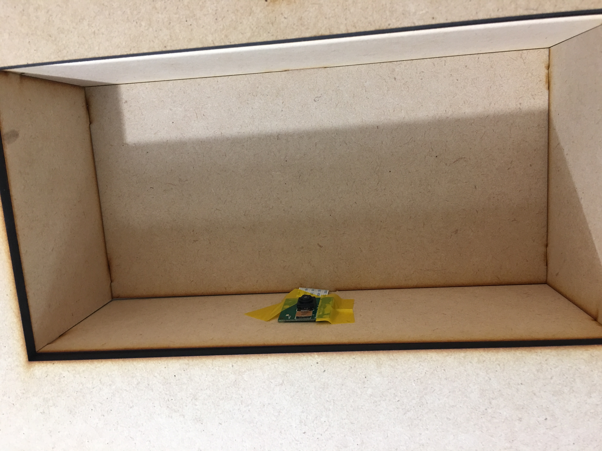

# ESLab2019Spring Final Project - QR code 自動取貨機

- 組名：請問不柏志要喝奶茶還是按摩呢？
- 組員：b05901170 陳柏志  b05901179 詹欣玥   b06901004 劉穎立
## 簡介
這是一台可以掃描QR code的自動取貨機，使用這先進到我們的網站下單，付款成功後會得到一個QR code，再拿著這個QR code到取貨機色掃描，機器便會吐出一個貨品。

DEMO 影片連結：

## 結構圖解
- 外殼(正)
三個開口由上而下依序為：顯示LCD螢幕、放QR code的位置、出貨口
左右兩側對稱，為兩獨立系統，可以放兩種貨品

- 外殼(側)
上面有四排可以放貨品的欄，一欄空了便會啟用下一欄，順序由左而右
下方是出貨的滑道

- 
## 運作系統

## 網頁

